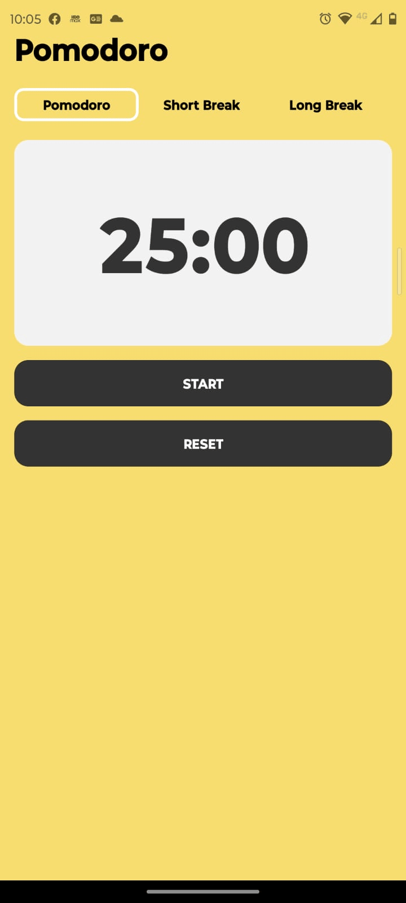
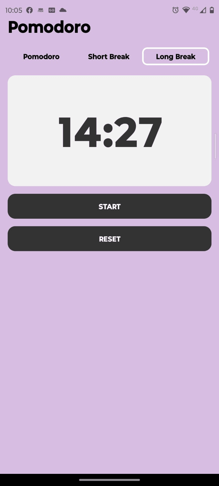
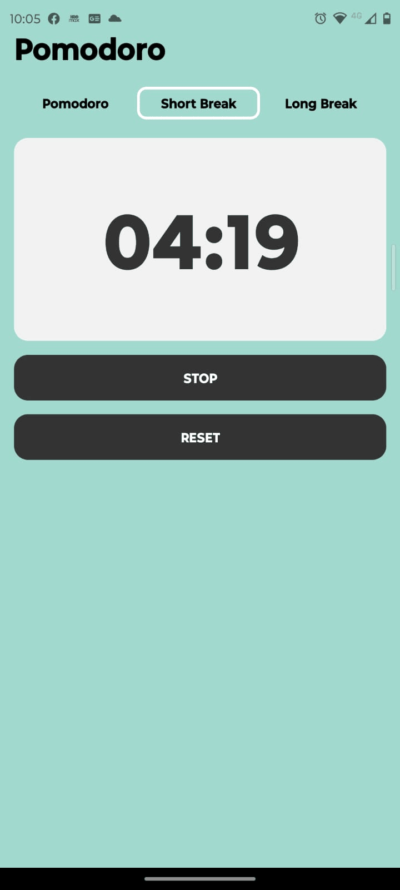

# Pomodoro
Este repositorio contiene una aplicación Pomodoro creada con Expo Go y React Native. La aplicación permite a los usuarios utilizar la Técnica Pomodoro para la gestión del tiempo y la mejora de la productividad. También incorpora sonido utilizando Expo AV para el botón de inicio/parada y cuenta con un botón de reinicio.

# Instalación
1. Asegúrate de tener Node.js y Expo Go instalados en su dispositivo Android o iOS desde las respectivas tiendas de aplicaciones.

2. Clone este repositorio en su máquina local.

3. Navegue al directorio del proyecto e instale las dependencias:

   ```bash
   npm install
   ```

# Fotos de la App
<div style="display: flex; justify-content: space-between;">



</div>

# Agradecimiento
Quiero expresar mi gratitud a Alberto Moedano que con su canal de YouTube [**Code with Beto en Español**](https://www.youtube.com/@codewithbeto1) me enseñó cómo crear esta aplicación Pomodoro con Expo Go y React Native. Este tutorial ha sido inmensamente útil; siendo nueva en este framework, aprendo mucho con sus aportes. Gracias a todos los que se dedican a hacer este tipo de contenidos!
